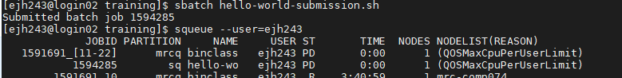

## Questions

    What is a scheduler and why does a cluster need one?

    How do I launch a program to run on a compute node in the cluster?

    How do I capture the output of a program that is run on a node in the cluster?

## Objectives

    Submit a simple script to the cluster.

    Monitor the execution of jobs using command line tools.

    Inspect the output and error files of your jobs.

## Job Scheduler

An HPC system might have thousands of nodes and thousands of users. How do we decide who gets what and when? How do we ensure that a task is run with the resources it needs? This job is handled by a special piece of software called the scheduler. On an HPC system, the scheduler manages which jobs run where and when. If you can relate to an instance where you had to wait for a while in a queue to get in to a popular restaurant, then you may now understand why sometimes your job do not start instantly as in your laptop.

The scheduler used on ISCA is Slurm. Although Slurm is not used everywhere, running jobs is quite similar regardless of what software is being used. The exact syntax might change, but the concepts remain the same.

## Running a Batch Job

The most basic use of the scheduler is to run a command non-interactively. Any command (or series of commands) that you want to run on the cluster is called a job, and the process of using a scheduler to run the job is called batch job submission.

In this case, the job we want to run is a shell script – essentially a text file containing a list of UNIX commands to be executed in a sequential manner. Our shell script `hello-world.sh` has the following parts:

+ On the very first line, #!/bin/sh. The #! (pronounced “hash-bang” or “shebang”) tells the computer what program is meant to process the contents of this file. In this case, we are telling it that the commands that follow are written for the command-line shell (what we’ve been doing everything in so far).
+ We then have a series of commands to print some information about our job
    + we use an `echo` command and `date` to print the time and date that the script started running.
    + we use `echo` to print the hello world message
    + `echo -n` will print everything that follows, without ending the line by printing the new-line character.
    + we invoke the `hostname` command, which will print the name of the machine the script is run on.
    + we finish using `echo` command and `date` to print the time and date that the script finished running.


```

#!/bin/sh

## print start date and time
echo Job started on:
date -u

echo "hello-world"

## print node job run on
echo -n "This script is running on "
hostname

## print end date and time
echo Job ended on:
date -u
```

We can run this script on ISCA by executing `sh hello-world.sh`. What output does this give you?


We can see from the name of the computer that this script ran on the login node, but we want to take advantage of the compute nodes: we need the scheduler to queue up hello-world.sh to run on a compute node.

To submit this task to the scheduler, we use the sbatch command. We also need to give Slurm some instructions on how to run the job. Schedulers like Slurm also have a special comment used to denote special scheduler-specific options. Though these comments differ from scheduler to scheduler, Slurm’s special comment is #SBATCH. Anything following the #SBATCH comment is interpreted as an instruction to the scheduler. 

An example job submission script for our hello world script is shown below.

```
#!/bin/sh
#SBATCH --export=ALL # export all environment variables to the batch job.
#SBATCH -p sq # submit to the serial queue
#SBATCH --time=00:10:00 # Maximum wall time for the job.
#SBATCH -A Research_Project-HPC-Training # research project to submit under. 
#SBATCH --nodes=1 # specify number of nodes.
#SBATCH --ntasks-per-node=16 # specify number of processors per node
#SBATCH --mail-type=END # send email at job completion 
#SBATCH --output=hello-world.o
#SBATCH --error=hello-world.e
#SBATCH --job-name=hello-world

## print start date and time
echo Job started on:
date -u

echo "hello-world"

## print node job run on
echo -n "This script is running on "
hostname

## print end date and time
echo Job ended on:
date -u
```

We submit this job by running `sbatch hello-world-submission.sh`. This creates a job which will run the script when dispatched to a compute node which the queuing system has identified as being available to perform the work. The output this time is different. 


Rather than provide the output from the script, instead we get a message saying `Submitted batch job` followed by a number. This number is the job id and can be used to track the job. Our work is done – now the scheduler takes over and tries to run the job for us. While the job is waiting to run, it goes into a list of jobs called the queue. To check on our job’s status, we check the queue using the command `squeue -u yourUsername`.



We can track our job in the output above, either by it's name or job ID. We can see here that it's currently being held in the queue (status = "PD"), once a resource becomes available this will change to an "R" to indicate that it is running. In this example, the job is being held in the queue, because the user already has their max allocation of jobs running on the system. In this case, the fair usage policy is preventing their job from running, rather than other users filling up the system. Now it's possible that your script has been run before you get a chance to monitor it, you should however receive an e-mail telling you that your job has finished and whether it was COMPLETED (i.e. ran without error) or FAILED (terminated due to an error.)

If you recall, when we run our script on the login node, the output was printed to the terminal – but now, when `squeue` shows the job has finished, nothing was printed to the terminal.

When we submitted our job to the cluster we told it where to redirect the output. Use ls to find and cat to read the file. 

## Queues

Compute resources on ISCA are partitioned into different queues, which are designed to manage different types of job. As is common with many other HPC systems, there are separate queues depending if your job is a serial job (`sq`) or parallel job (`pq`). There are also test queues (`stq` and `ptq`), which are designed to provide rapid access to test and develop scripts. This is achieved by having a maximum wall time of 1 hour for jobs submitted to these queues. The high memory nodes are also accessed by submitting to a specific queue (`highmem`). This is similarly the case for the gpus (`gpu`). To submit your job to a different queue, you need to change the `-p` flag in your submission script. 

There are also a number of other specialised queues which are reserved for specific projects. Your PI should be able to tell you if these are relevant for your project.

You can determine the status of the queues by running the command `sinfo`.

## Resource Requests

One thing that is absolutely critical when working on an HPC system is specifying the resources required to run a job. This allows the scheduler to find the right time and place to schedule our job. If you do not specify requirements (such as the amount of time you need), you will likely be stuck with your site’s default resources, which is probably not what you want.

The following are several key resource requests:

--ntasks=<ntasks> or -n <ntasks>: How many CPU cores does your job need, in total?

--time <days-hours:minutes:seconds> or -t <days-hours:minutes:seconds>: How much real-world time (walltime) will your job take to run? The <days> part can be omitted.

--mem=<megabytes>: How much memory on a node does your job need in megabytes? You can also specify gigabytes using by adding a little “g” afterwards (example: --mem=5g)

--nodes=<nnodes> or -N <nnodes>: How many separate machines does your job need to run on? Note that if you set ntasks to a number greater than what one machine can offer, Slurm will set this value automatically.

Note that just requesting these resources does not make your job run faster, nor does it necessarily mean that you will consume all of these resources. It only means that these are made available to you. Your job may end up using less memory, or less time, or fewer nodes than you have requested, and it will still run.

It’s best if your requests accurately reflect your job’s requirements. We’ll talk more about how to make sure that you’re using resources effectively in a later episode of this lesson.

## Job environment variables

When Slurm runs a job, it sets a number of environment variables for the job. One of these will let us check what directory our job script was submitted from. The `SLURM_SUBMIT_DIR` variable is set to the directory from which our job was submitted. 

We can modify our job submission script so that it prints out the location from which the job was submitted.


```
#!/bin/sh
#SBATCH --export=ALL # export all environment variables to the batch job.
#SBATCH -p sq # submit to the serial queue
#SBATCH --time=00:10:00 # Maximum wall time for the job.
#SBATCH -A Research_Project-HPC-Training # research project to submit under. 
#SBATCH --nodes=1 # specify number of nodes.
#SBATCH --ntasks-per-node=16 # specify number of processors per node
#SBATCH --mail-type=END # send email at job completion 
#SBATCH --output=hello-world.o
#SBATCH --error=hello-world.e
#SBATCH --job-name=hello-world

## print start date and time
echo Job started on:
date -u

echo "hello-world"

## print node job run on
echo -n "This script is running on "
hostname

echo "This job was launched in the following directory:"
echo ${SLURM_SUBMIT_DIR}

## print end date and time
echo Job ended on:
date -u
```

Resource requests are typically binding. If you exceed them, your job will be killed. Let’s use wall time as an example. We will request 1 minute of wall time, and attempt to run a job for two minutes.

```
#!/bin/sh
#SBATCH --export=ALL # export all environment variables to the batch job.
#SBATCH -p sq # submit to the serial queue
#SBATCH --time=00:01:00 # Maximum wall time for the job.
#SBATCH -A Research_Project-HPC-Training # research project to submit under. 
#SBATCH --nodes=1 # specify number of nodes.
#SBATCH --ntasks-per-node=16 # specify number of processors per node
#SBATCH --mail-type=END # send email at job completion 
#SBATCH --output=hello-world.o
#SBATCH --error=hello-world.e
#SBATCH --job-name=long-job

## print start date and time
echo Job started on:
date -u


echo "This script is running on ... "
sleep 240 # time in seconds
hostname

## print end date and time
echo Job ended on:
date -u
```

Submit the job and wait for it to finish. Once it is has finished, check the log file.

Our job was killed for exceeding the amount of resources it requested. Although this appears harsh, this is actually a feature. Strict adherence to resource requests allows the scheduler to find the best possible place for your jobs. Even more importantly, it ensures that another user cannot use more resources than they’ve been given. If another user messes up and accidentally attempts to use all of the cores or memory on a node, Slurm will either restrain their job to the requested resources or kill the job outright. Other jobs on the node will be unaffected. This means that one user cannot mess up the experience of others, the only jobs affected by a mistake in scheduling will be their own.

## Cancelling a Job

Sometimes we’ll make a mistake and need to cancel a job. This can be done with the scancel command. Let’s submit a job and then cancel it using its job number (remember to change the walltime so that it runs long enough for you to cancel it before it is killed!). A clean return of your command prompt indicates that the request to cancel the job was successful.

## Other Types of Jobs

Up to this point, we’ve focused on running jobs in batch mode. Slurm also provides the ability to start an interactive session.

There are very frequently tasks that need to be done interactively. Creating an entire job script might be overkill, but the amount of resources required is too much for a login node to handle.

` srun --time=12:0:0 --nodes=1 --ntasks-per-node=16 -p sq -A Research_Project-HPC-Training --pty bash`

We can then enter our commands as required for example running our `hello-world.sh` shell script.